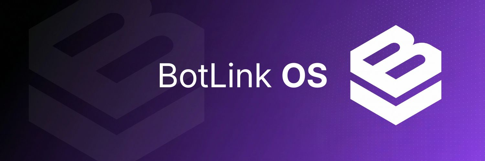

 

# BotLink OS

### The Decentralized Economic Layer for Autonomous Fleets.

 

[Website](https://botlinkos.tech) • [Documentation](https://docs.botlinkos.tech) • [X (Twitter)](https://x.com/botlinkos)

 

---

## About

The **Machine Economy** is here. Autonomous agents—drones, robots, vehicles—are no longer science fiction. They're operating at scale, and they need infrastructure to **transact**, **verify**, and **coordinate** without human intervention.

**BotLink OS** is the protocol that makes **M2M Commerce** (Machine-to-Machine Commerce) possible. We provide the economic rails for the next trillion autonomous transactions.

### Core Pillars

- 🤖 **Identity** — Decentralized identifiers (DIDs) for every machine in your fleet.
- 💰 **Economy** — Native payment rails enabling real-time M2M micropayments via $BLOS.
- 🔐 **Verification** — Zero-Knowledge proofs for trustless attestation and compliance.

---

## Built With

---

## Repository

---

 

**Powered by $BLOS**

 

